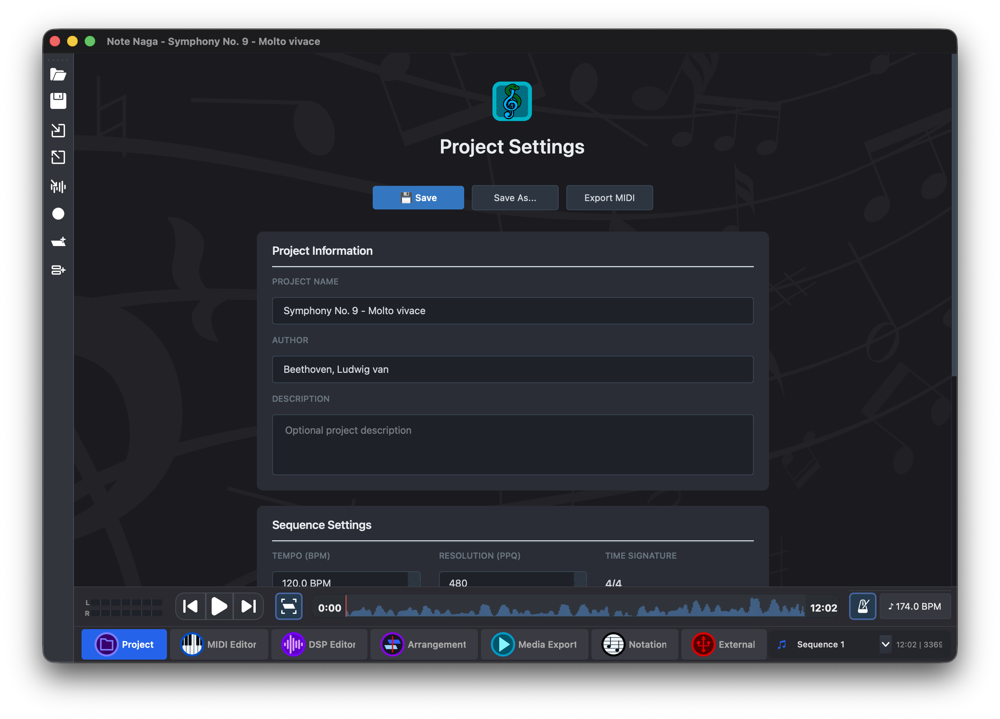
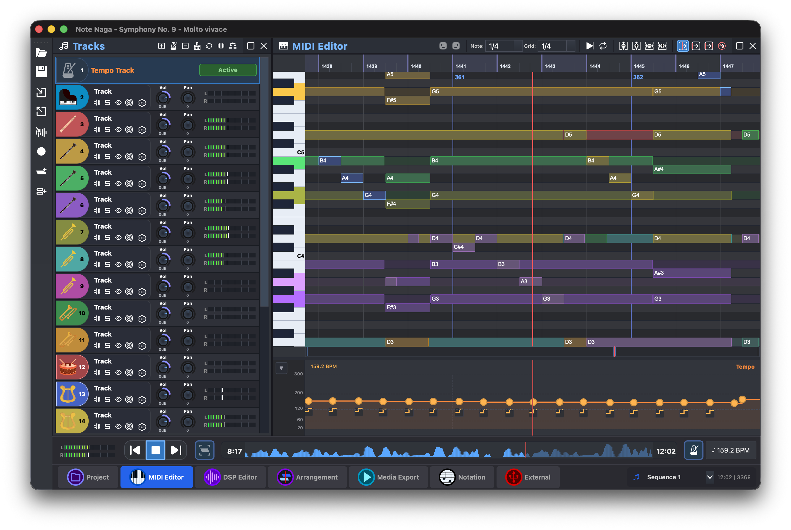
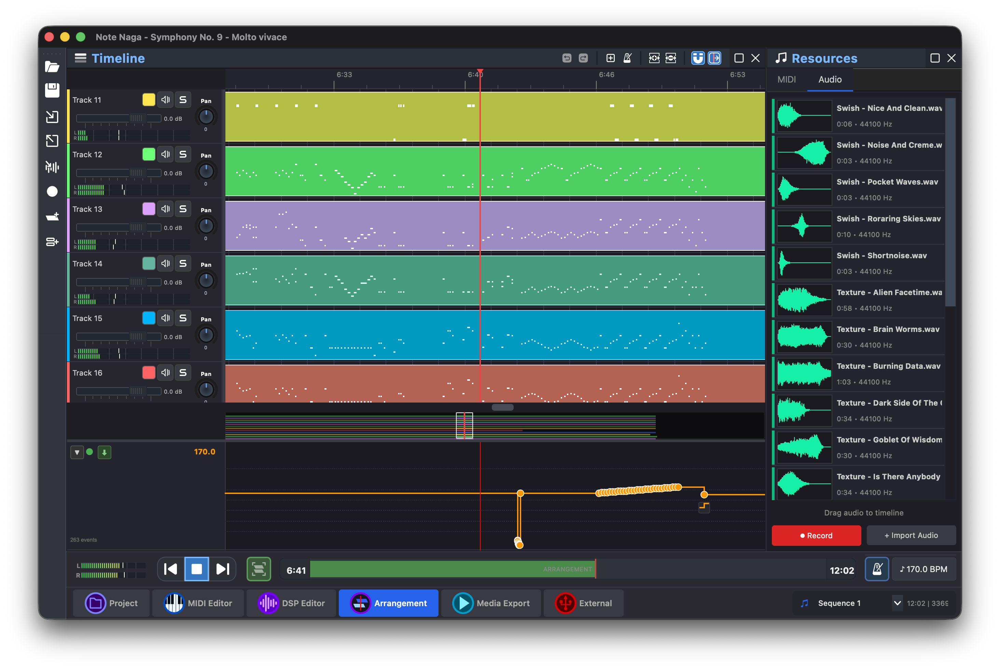
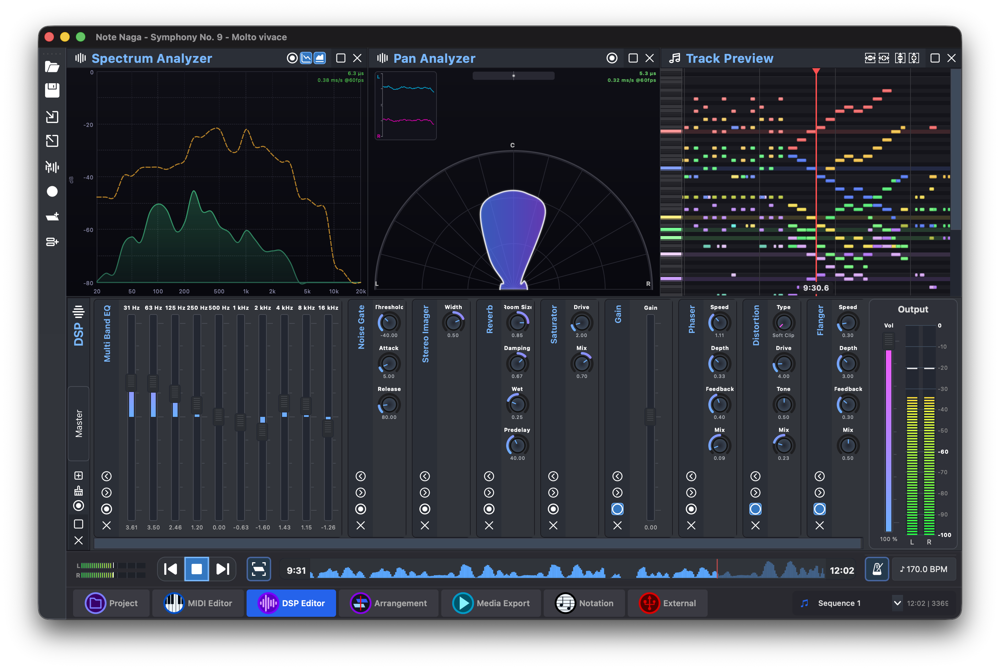
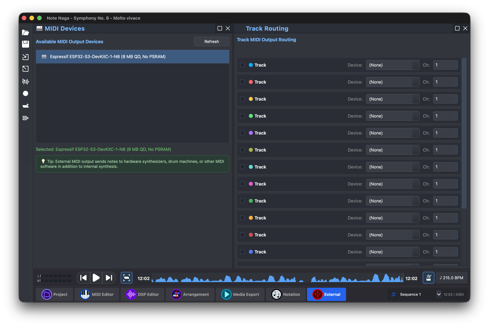
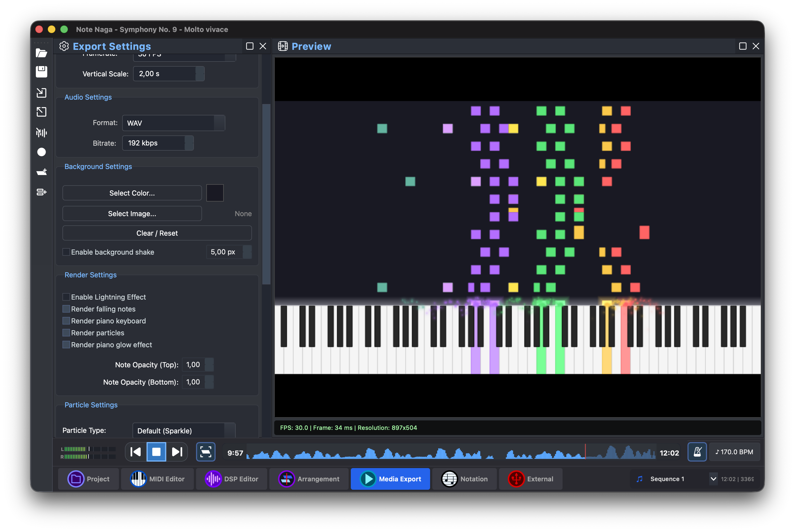
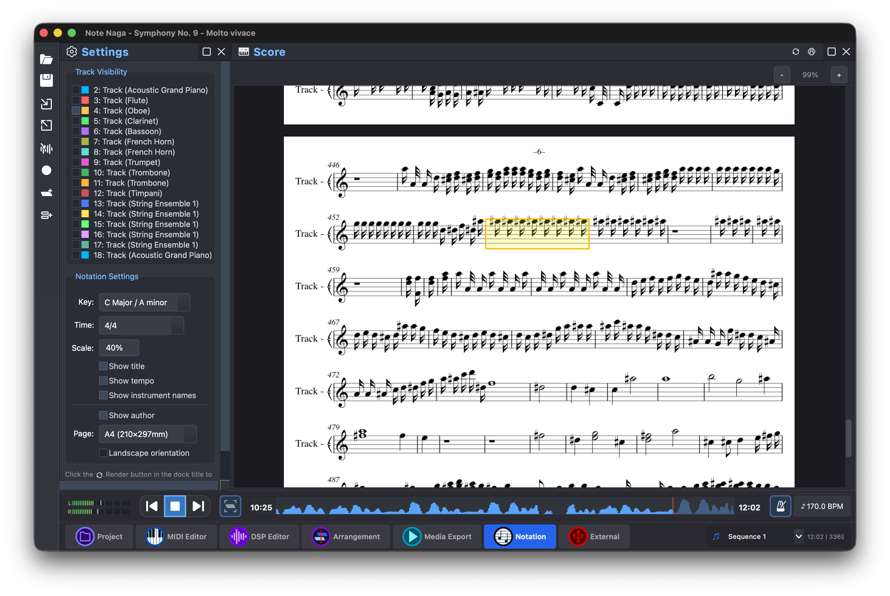
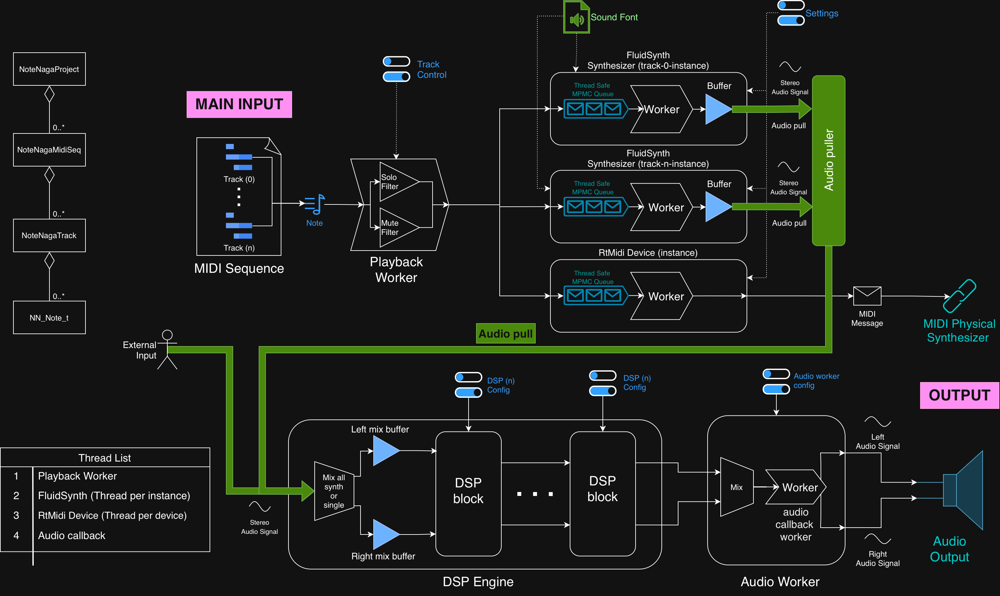

<div align="center">


# Note Naga

[](https://github.com/0xMartin/NoteNagaCPlusPlus)
[](LICENSE)
[](https://github.com/0xMartin/NoteNagaCPlusPlus)

**DAW-like music production application with MIDI editing, arrangement, audio recording, and video export capabilities**

[Sections](#-sections) • [Installation](#-installation) • [Engine](#-note-naga-engine) • [Todo](#-todo) • [Technologies](#-technologies)

</div>

---

## Overview

Note Naga is a comprehensive music production application built with C++ and Qt. It combines a powerful MIDI editor with arrangement capabilities, audio recording, external MIDI routing, notation rendering, and advanced media export features. The application is powered by a custom real-time audio engine that handles synthesis, DSP processing, and audio/MIDI playback.

> **Note:** This application is developed and tested on macOS. Functionality and build compatibility on Linux and Windows is not guaranteed.

---

## Sections

Note Naga is organized into multiple sections, each focused on a specific aspect of music production:

---

### Project Section

Configure your project settings including project name, author information, tempo, time signature, and other global project parameters.



---

### MIDI Editor Section

A classic piano roll MIDI editor for composing and editing music. Features include:
- Multi-track MIDI editing with unlimited tracks
- Note editing with velocity, pan, and duration controls
- Tempo track with tempo changes support
- Grid snapping with multiple resolution options
- Advanced note manipulation tools (quantize, humanize, transpose, legato, staccato)
- Loop playback for seamless workflow



---

### Arrangement Section

A timeline-based arrangement view for organizing your composition:
- Place MIDI clips and audio clips on timeline tracks
- Trim, cut, and move clips with precise control
- Fade in/out support for smooth transitions
- Per-track volume and pan controls
- Import audio files from disk
- Record audio directly from microphone input
- Arrange and structure complete songs



---

### DSP Effects

The integrated DSP engine provides professional audio processing with 20+ effect blocks including: Gain, Pan, Compressor, Limiter, Noise Gate, Single/Multi-band EQ, Filter, Reverb, Delay, Chorus, Flanger, Phaser, Saturator, Exciter, Tremolo, Stereo Imager, Bitcrusher, Distortion, Auto-Wah, De-Esser, and more.



---

### External MIDI Section

Route MIDI notes from your tracks to external hardware synthesizers and MIDI devices:
- Scan and connect to available MIDI output devices
- Per-track routing configuration
- Channel assignment for each track
- Real-time connection status monitoring



---

### Media Export Section

Export your composition as video or audio with extensive customization options:
- Video export with visual piano roll animation
- Audio-only export in various formats
- Video effects: particles, screen shake, background images, opacity, lightning effects
- Customizable resolution and frame rate
- Real-time preview before export



> Video export example: [https://youtu.be/78l0hsS38Ow](https://youtu.be/78l0hsS38Ow)

---

### Notation Section

Generate traditional music notation from selected MIDI tracks:
- Automatic note transcription to staff notation
- Support for multiple tracks
- Clean and readable output



---

## Installation

### Prerequisites
- **CMake** 3.16 or higher
- **Qt** 5 or 6 (Widgets, Concurrent, Svg)
- **OpenCV** (for video export)
- **FluidSynth** (for SoundFont synthesis)
- **RtMidi** (for MIDI I/O)
- **RtAudio** (for audio I/O)
- **C++20** compatible compiler

### Build Instructions

```bash
# Clone the repository
git clone https://github.com/0xMartin/NoteNagaCPlusPlus.git
cd NoteNagaCPlusPlus

# Build with CMake
cmake -S . -B build
cmake --build build -j8

# Run the application
./build/NoteNaga.app/Contents/MacOS/NoteNaga  # macOS
./build/NoteNaga                               # Linux
./build/NoteNaga.exe                           # Windows
```

---

## Note Naga Engine

The application is powered by **note_naga_engine**, a custom real-time audio engine that is also part of this repository. The engine can be built independently without Qt dependencies.

### Engine Architecture



The engine features a multi-threaded architecture:
- **Playback Worker** - Handles MIDI sequence playback and note scheduling
- **Audio Worker** - Manages real-time audio output and buffer management
- **DSP Engine** - Processes audio through configurable effect chains
- **External MIDI Router** - Routes notes to external MIDI devices
- **Spectrum Analyzer** - Provides real-time frequency analysis

### Build Engine Only

```bash
cd note_naga_engine
cmake -S . -B build -DQT_DEACTIVATED=ON
cmake --build build -j8
```

---

## Todo

Future improvements and known issues:

- [ ] **Arrangement section polish** - Improve timeline editing UX and add more clip manipulation features
- [ ] **Bug: Audio clip playback delay** - Fix timing issues with audio clip playback in arrangement section
- [ ] **Menu bar / Toolbar improvements** - Expand and reorganize menu structure for better workflow
- [ ] **Plugin support** - VST/AU plugin hosting for external instruments and effects
- [ ] **Undo/Redo** - Improve undo system coverage across all sections
- [ ] **Test coverage** - Add unit and integration tests for core engine and GUI components
- [ ] **Complex Audio Tools** - Add spectral editing, time-stretching, pitch-shifting capabilities

---

## Technologies

Note Naga is built using the following technologies and libraries:

| Library | Purpose |
|---------|---------|
| **Qt** | Cross-platform GUI framework |
| **FluidSynth** | SoundFont-based software synthesizer |
| **RtMidi** | Real-time MIDI input/output |
| **RtAudio** | Real-time audio input/output |
| **Verovio** | Music notation engraving (external library) |
| **OpenCV** | Video processing and export |

---

## License

This project is licensed under the MIT License - see the [LICENSE](LICENSE) file for details.

## Author

**Martin Krčma (0xMartin)**

- GitHub: [@0xMartin](https://github.com/0xMartin)

---

<div align="center">

**Made with ❤️ by 0xMartin**

</div>